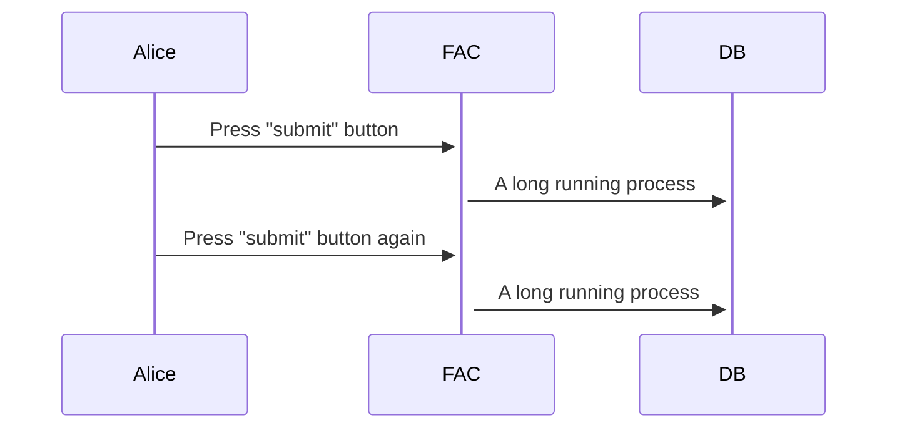
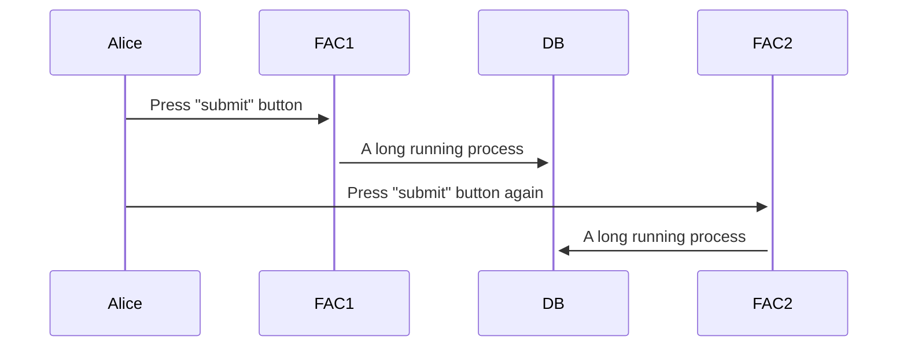

# **Submission race hazard, round 2**

There are multiple ways for a “race” to happen on the web. By this, I mean a “race condition,” which is where two processes (computers, etc.) try and do the same thing at the same time… but only one can “win” the race. 

The FAC is susceptible to race hazards in at least two different ways. 

1. Every time we update our state machine, we are writing to the DB. It is possible for multiple instances of the FAC to update the FSM out-of-order, and as a result, break the state machine. *This document will be updated when/if this concern is addressed. It appears to be very low probability given the current FSM/FAC architecture*.
2. When a user submits, they might hit the "submit" button more than once, launching the submission process multiple times on a single FAC instance, or on more than one instance simultaneously. *This document describes this condition, and the fix we implemented in Sept 2024 for this problem*.

(There is much more to be said about [race conditions](https://en.wikipedia.org/wiki/Race_condition), or race hazards… for purposes of this document, we’ll just say that they’re not fun. However, if you like programming puzzles, Alan Downey’s *The Little Book of Semaphores* is a marvelous open text, and explores the concept of race hazards in depth through a series of programming exercises and puzzles. [https://greenteapress.com/wp/semaphores/](https://greenteapress.com/wp/semaphores/))

### Revision history
* 20240913 initial version

## Scenario 1: A single FAC application

The first scenario to consider is when a user (Alice) initiates a submission action more than once.




In this situation, Alice presses a button, and a socket is opened (because we are expecting a response). The server then launches a long-running process. When Alice presses the button again, the socket is broken. Because our application has no way of knowing that the connection was broken, it has no way of cleaning up or canceling the long-running process. Therefore, we end up in a situation where the long-running process is now running *twice* and *at the same time*.

If that long-running process is the validation of a submission and the dissemination of the submission, that means we now have to answer many questions: which process will finish first? Will they both complete... partially? In full? This is why it is called a *race hazard*, because the hazard is that our application or data may end up in an indeterminate state because one process (or the other) in the race completes more or less completely, in an unpredictable order of operations.

This is one way the FAC is susceptible to races. There is another.

## Scenario 2: Multiple FAC applications



On cloud.gov, we run multiple instances of the FAC.

 When Alice pushes the submit button, she can launch a process running on FAC1. When she pushes the same button a second time, it is possible that the request will be sent to FAC2—a completely different instance of the FAC application.

In the first scenario, it is (in theory) possible to make sure that a single user does not launch the same process twice.

In this second scenario, it is *very difficult* to prevent this behavior. It would require coordination between FAC1 and FAC2 to make sure that Alice is not asking to “do the same thing twice.”

The end result is the same, however. If Alice has asked to complete her submission, there are now two copies of the FAC that are racing to disseminate data. And, again, it is possible for the FAC data to end up in an indeterminate state as a result.

## The challenge: an in-memory state machine

We use a state machine to determine where we are in the submission process. At the end of a submission process, we go from `AUDITOR_CERTIFIED` to `AUDITEE_CERTIFIED` to `SUBMITTED` to `DISSEMINATED`. The issue at hand lies in the last two states, and the fact that there are two FACs.

When Alice pushes the `Submit` button, the following things happen in this order:

1. 🐢 We get the report id, and load the SAC object (a complete submission) corresponding to it from the database.  
2. 🐢 We run a full validation.  
3. If there are errors, we return an error.  
4. We then move the audit to the `SUBMITTED` state.   
   1. 🐢 We do this by updating the SAC object and saving it to the DB.  
5. We then set up an atomic block.  
   1. 🐢 We disseminate the data (meaning, copy it from the internal table to external/public tables).  
   2. We check for errors on the dissemination  
      1. If no errors arose, we transition to the `DISSEMINATED` state  
         1. 🐢 We do this by updating the SAC object and saving it to the DB.  
      2. If there were errors, we do nothing.

There are multiple problems with this. We will assume that there are two FACs (FAC1, FAC2), and consider each as a point where the results of the race could change. For example…

| Timestep | FAC1 | FAC2 |
| :---- | :---- | :---- |
| 1 | *Alice pushes the button* | | 
| 2 | 🐢 Get SAC | *Alice presses button second time…* |
| 3 | 🐢 *gets held up on validation…* | 🐢 Get SAC |
| 4 |  | Validates quickly |
| 5 |  | Save `SUBMITTED` |
| 6 |  | Disseminate data |
| 7 |  | Save `DISSEMINATED` |
| 8 |  | *FAC2 exits cleanly* |
| 9 | Validates quickly |  |
| 10 | Save `SUBMITTED` |  |
| 11 | 🧨 **fails to disseminate** 🧨 |  |
| 12 | *FAC1 crashes out without Alice knowing, because she is now experiencing FAC2* |  |

The end result would be data that was fully disseminated, but in a `SUBMITTED` state.

*However*, **it will be worse than it appears**. Not only will we end up with a disseminated audit in this case… but we will see no record of it in the SAC object. Why? When FAC1 comes through and updates to the submitted state, it writes its entire *in-memory* state machine out to the SAC object. FAC1 has no idea that FAC2 has proceeded through and updated the SAC object (and the states)... so, it overwrites, in the internal table, any evidence that a submission (and dissemination) took place. We therefore have data disseminated, but the SAC object claims to have only made it to the `SUBMITTED` state, with no dissemination timestamp.

*This is only one possible outcome of a race*. There are others that leave the database in *other different* misconfigurations.

## A solution: `atomic` commits

Because we live with two FACs, we cannot *casually* synchronize the FAC instances. This is because they are executing (for all intents and purposes) on separate computers. Further, they do not know about each-other; we would have to develop a whole set of machinery for them to 1\) know about all of the running FAC instances, and 2\) communicate and collaborate to make sure only one of them takes any given action. It is entirely likely we would then have to implement code to solve the [dining philosopher's problem](https://en.wikipedia.org/wiki/Dining_philosophers_problem), which is extremely error prone/tedious.

However, all of the FAC instances use one database. This is to our benefit. (If we ever start writing to *multiple, distinct* databases, this will break again. Badly.) 

We could attempt to use the database to synchronize the state machine between multiple FAC instances, but this is harder to do than it might at first appear. (Or, it might lead to additional places where we have races on the state machine synchronization points.) This does want to be investigated, but it is not the most direct solution to the race at hand.

Instead, we will make sure that the *entirety* of the submission process happens, or it does not happen at all. Making sure a database operation (or set of operations) all happen (or fail to happen) is known as *automaticity*. 

The critical code is in `backend/audit/views/views.py`, lines [755-815](https://github.com/GSA-TTS/FAC/blob/1cc9170b48b005315f5caebc64b57d0aa770f839/backend/audit/views/views.py#L755) in the `jadudm/fix-submission-race` branch. A simplified version of the code follows.

```py
            with transaction.atomic():
                sac.transition_to_submitted()
                🍓 sac.save(EventType.SUBMITTED)
                🍎 disseminated = sac.disseminate()
                if disseminated is None:
                    sac.transition_to_disseminated()
                    🍐sac.save(EventType.DISSEMINATED)
                    remove_workbook_artifacts(sac)
            if disseminated is not None:
                # Log/ present error to user
            return redirect(reverse("audit:MySubmissions"))

```

The first step (line 755\) is to declare that we want our Django interactions with the database to be atomic. This means that either *all database operations* *succeed* or *all database operations fail* within the block. There are three distinct database writes within the block.

1. The `sac.save()` on the transition to the `SUBMITTED` state ([line 765](https://github.com/GSA-TTS/FAC/blob/1cc9170b48b005315f5caebc64b57d0aa770f839/backend/audit/views/views.py#L765), 🍓 above)  
2. The dissemination of the data ([line 790](https://github.com/GSA-TTS/FAC/blob/1cc9170b48b005315f5caebc64b57d0aa770f839/backend/audit/views/views.py#L790), 🍎)  
3. The save on the transition to `DISSEMINATED` ([line 801](https://github.com/GSA-TTS/FAC/blob/1cc9170b48b005315f5caebc64b57d0aa770f839/backend/audit/views/views.py#L801), 🍐)

Now, if we look at the above race…

| Timestep | FAC1 | FAC2 |
| :---- | :---- | :---- |
| 1 | Get SAC | *Alice presses button second time…* |
| 2 | 🐢*gets held up on validation…* | Get SAC |
| 3 |  | Validates quickly |
| 4 |  | Save `SUBMITTED` |
| 5 |  | Disseminate data |
| 6 |  | Save `DISSEMINATED` |
| 7 |  | *FAC2 exits cleanly* |
| 8 | Queue save `SUBMITTED` |  |
| 9 | Queue dissemination of data |  |
| 10 | Queue save `DISSEMINATED` |  |
| 11 | *FAC1 database update fails because of a primary key conflict on `dissemination_general`. Therefore, no database operations happen. Alice has no idea.* |  |

While we may want to have FAC1 log an error and exit gracefully, the important thing is that as far as Alice is concerned, her audit was submitted, it made it through for her to check in basic search, and we avoided ended up in an inconsistent state.

## Conclusion

What is described is one part of the fix for this problem. The other is to disable the submit button once it is pressed. This README and the PR with the race fix is one of two PRs that address this submission bug.

There are other ways we could solve this. However, by putting the final submission sequence under one atomic block, we guarantee that a single user cannot 1\) button-mash their way to an error, or 2\) run the FAC in two separate windows and create a race hazard the hard way.

