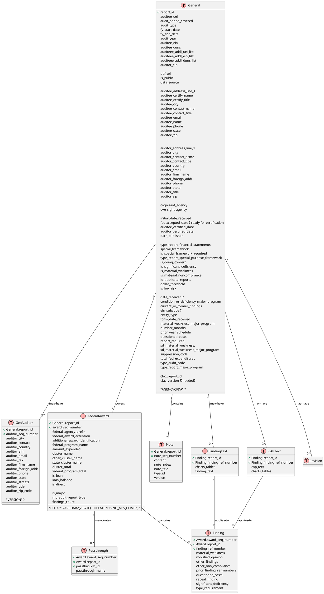

FAC Data Dissemination Data Model

```plantuml
@startuml Data Model

!define TABLE(name,desc) class name as "desc" << (T,#FFAAAA) >>
!define PRIMARY_KEY(x) <color:red>x</color>
!define FOREIGN_KEY(x) <color:blue>x</color>

hide empty attributes

TABLE(General, "General") {
    + report_id
    auditee_uei
    audit_period_covered
    audit_type
    fy_start_date
    fy_end_date 
    audit_year                   /'22 AUDITYEAR '/
    auditee_ein
    auditee_duns
    auditeee_addl_uei_list
    auditeee_addl_ein_list
    auditeee_addl_duns_list
    auditor_ein

    pdf_url                           /' GFAC '/
    is_public
    data_source                       /'GFAC or CFAC '/

    auditee_address_line_1
    auditee_certify_name  
    auditee_certify_title
    auditee_city
    auditee_contact_name
    auditee_contact_title             /'22 AUDITEENAMETITLE and AUDITEETITLE'/
    auditee_email
    auditee_name
    auditee_phone
    auditee_state
    auditee_zip
    

    auditor_address_line_1 
    auditor_city
    auditor_contact_name
    auditor_contact_title             /' 22 CPANAMETITLE '/
    auditor_country
    auditor_email
    auditor_firm_name 
    auditor_foreign_addr              /' 22 CPAFOREIGN'/
    auditor_phone
    auditor_state
    auditor_title
    auditor_zip
    
    cognizant_agency
    oversight_agency

    initial_date_received 
    fac_accepted_date ? ready for certification
    auditee_certified_date
    auditor_certified_date 
    date_published

    type_report_financial_statements
    special_framework
    is_special_framework_required 
    type_report_special_purpose_framework
    is_going_concern
    is_significant_deficiency
    is_material_weakness 
    is_material_noncompliance 
    id_duplicate_reports
    dollar_threshold
    is_low_risk 

    ' JM: Need to understand the following
    ' JM: What about 3d in Part III - ageny reference
    date_received ?
    condition_or_deficiency_major_program 
    current_or_former_findings        /'22 CYFINDINGS '/
    ein_subcode ?
    entity_type
    form_date_received 
    material_weakness_major_program
    number_months
    prior_year_schedule 
    questioned_costs 
    report_required  
    sd_material_weakness, 
    sd_material_weakness_major_program
    suppression_code  
    total_fed_expenditures 
    type_audit_code     
    type_report_major_program  
    
    cfac_report_id
    cfac_version ??needed?
    ' JM: Do we need CFAC DN_KEY?

    ' hist_auditee_address_line_2            /' STREET2 Historic data '/
    ' hist_auditee_fax                       /' Historic data '/
    ' hist_auditor_address_line_2            /' CPASTREET2 Historic data '/
    ' hist_auditor_fax                       /' Historic data '/
    ' hist_completed_date                    /' Historic data '/
    ' hist_copies                            /' Historic data '/
    ' hist_date_firewall                     /' Historic data '/
    ' hist_date_received_other               /' Historic data '/ 
    ' hist_component_date_received           /' Historic data '/
    ' hist_image                             /' Historic data '/
    ' hist_type_of_entity                    /' Historic data '/
    ' hist_previous_completed_on_date    /' Historic data '/  
    ' hist_previous_date_firewall            /' Historic data '/
    ' hist_previous_date_published           /' Historic data '/
    ' hist_reportable_condition              /' Historic data '/
    ' hist_reportable_condition_major_program    /' Historic data '/
    ' hist_significant_deficiency_major_program  /' Historic data.  22 SIGNIFICANTDEFICIENCY_MP '/
    ' hist_finding_ref_num
  "AGENCYCFDA" ?

}

TABLE(Auditor, "GenAuditor") {
  + General.report_id
  + auditor_seq_number
    auditor_city
    auditor_contact
    auditor_country 
    auditor_ein 
    auditor_email
    auditor_fax 
    auditor_firm_name 
    auditor_foreign_addr
    auditor_phone
    auditor_state 
    auditor_street1 
    auditor_title 
    auditor_zip_code
 
    "VERSION" ? /' Discuss with Matt '/
}


TABLE(Award, "FederalAward") {
  + General.report_id
  + award_seq_number 
  federal_agency_prefix
  federal_award_extension 
  additional_award_identification 
  federal_program_name
  amount_expended 
  cluster_name
  other_cluster_name
  state_cluster_name
  cluster_total
  federal_program_total 
  is_loan
  loan_balance
  is_direct 

  is_major 
  mp_audit_report_type 
  findings_count 
  
  ' --need more clarity on these fields
  ' is_guaranteed 
  ' is_passed 
  ' passthrough_amount
  ' passthrough_award
  ' program_name
  ' subrecipient_amount 
  ' type_requirement

  ' not needed for now
  ' hist_research_and_development 
  ' hist_questioned_costs2                             /' Historic data '/ 
  ' hist_findings                                    /' Historic data '/
  ' hist_arra 
  ' hist_typereoirt_mp_iverride
  "CFDA2" VARCHAR2(2 BYTE) COLLATE "USING_NLS_COMP", ?	
}

TABLE(Passthrough, "Passthrough") {
  + Award.award_seq_number /' Old ELECSAUDIT '/
  + Award.report_id
  + passthrough_id
  passthrough_name
}


TABLE(Finding, "Finding") {
  + Award.award_seq_number /' To be added to GFAC '/
  + Award.report_id
  + finding_ref_number /' GFAC '/
  material_weakness
  modified_opinion
  other_findings
  other_non_compliance
  prior_finding_ref_numbers
  questioned_costs
  repeat_finding
  significant_deficiency
  type_requirement

  ' hist_findingrefnums
}

TABLE(Note, "Note") {
  + General.report_id
  + note_seq_number
  content
  note_index
  note_title
  type_id 
  version /' Is this the latest version? Discuss with Matt.  Is this required in General? '/
}


TABLE(FindingText, "FindingText") {
  + Finding.report_id
  + Finding.finding_ref_number
  charts_tables
  finding_text
}

TABLE(CAPText, "CAPText") {
  + Finding.report_id
  + Finding.finding_ref_number
  cap_text
  charts_tables
}


TABLE(Revision, "Revision") {
  /' Maybe needed only for Historical data' 
  Is this needed for GFAC? - Decision to be made.'/
}

General "1" -- "*" Award : covers
General "1" -- "0,*" Auditor : may-have
General "1" -- "0,*" Revision : may-have
General "1" -- "0,*" FindingText : may-have
General "1" -- "0,*" CAPText : may-have
Award "1" -- "0,*" Passthrough : may-contain
Award "1" -- "*" Finding : contains
General "1" -- "*" Note : contains
FindingText “1” -- “*” Finding : applies-to
CAPText “1” -- “*” Finding : applies-to

@enduml
```
