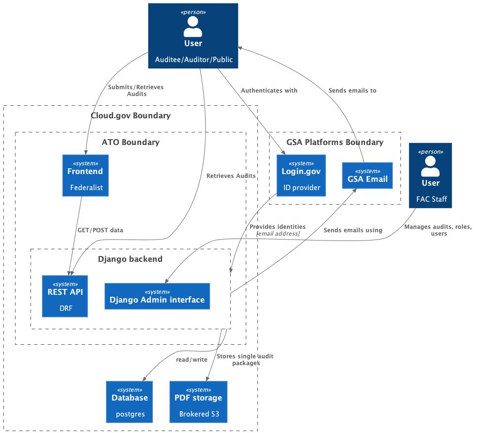

# 3. Initial system architecture

Date: 2022-03-30

## Status
Accepted

## Context
This is a greenfield build project, to evaluate options and settle on an initial architecture we have:

* Defined the functional scope of a MVP towards which we're building
* Mapped our understanding of the systems _surrounding_ the MVP
* Surveyed and reviewed existing TTS projects and documentation such as https://engineering.18f.gov/
* Reviewed and discussed proposals as an engineering team

Proposed architecture which was reviewed by the engineering team:

## Decision

Finding no immediate needs not met by TTS `default` choices for infrastructure and datastore, **we will build on a foundation of cloud.gov** and;

* Use cloud.gov as our PaaS for development, staging, and production environments
* Use cloud.gov brokered Postgres AWS RDS instances for all data
* Use cloud.gov brokered S3 instances for storage of PDF blobs.

**The frontend will be developed and hosted on Cloud.gov Pages**.
We will maintain separation between the frontend and backend as distinct systems. This separation will;

* Allow us to leverage Pages functionality to streamline prototyping and development efforts
* De-couple development from the backend. A contributor to the frontend need not have any knowledge of the code, infrastructure, or build pipeline of the backend.
* Not add additional risk or cost should we later decide to serve the frontend from the backend system.
* Serve as the first consumer of the backend API

**We will use Python & Django for the backend. Using Django will allow us to:**

* Move quickly given the current engineering team's background
* Leverage existing patterns from other TTS efforts such as civilrights.justice.gov
* Provide functionality such as the admin interface which we believe will fulfill some MVP requirements with minimal modification

## Consequences

* We'll establish separate development and build environments for the backend and frontend
* The backend will be written in Python and we'll strive for idiomatic Django implementations leveraging existing work where ever possible.
* We'll need to tackle a legacy data migration from Oracle -> Postgres

