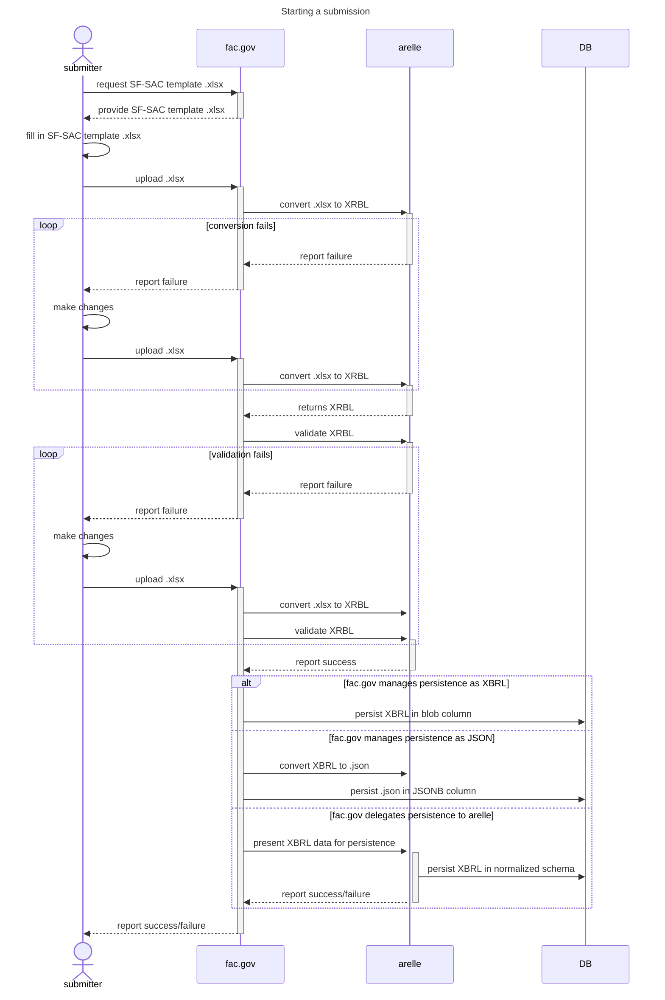
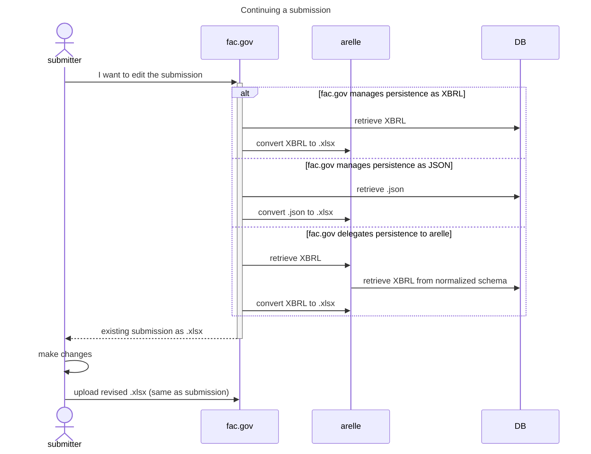
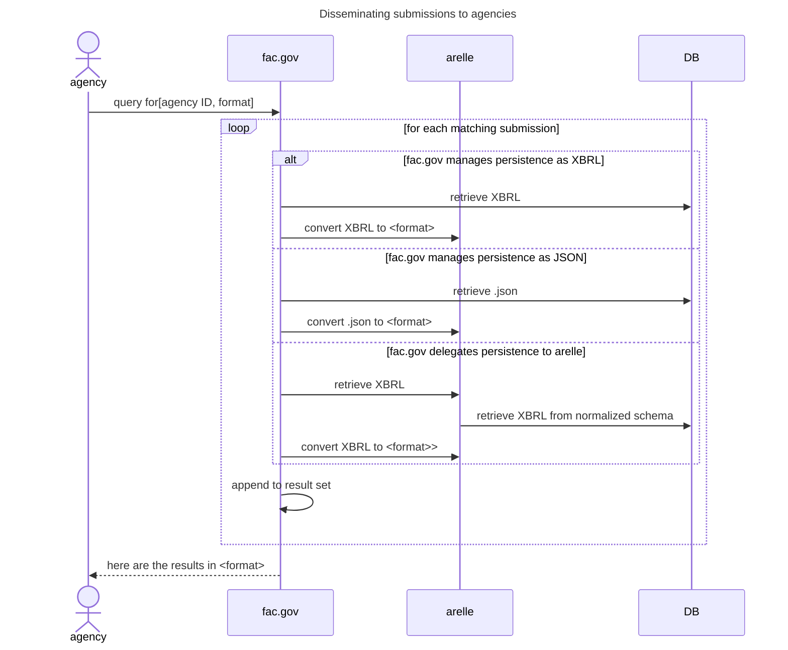

# 15. Use XBRL+Arelle as a hub for data transformation

Date: 2023-01-23

## Status

Accepted

## Context

1. The FAC system needs to accept submissions in at least Excel and JSON formats, and possibly other standards in the future.
2. Round-tripping content from JSON to Excel and back is finicky business, and implementing it in front-end/client-side code will involve significant effort without much FAC-specific value.
3. As a consequence of the GREAT Act, the FAC system will need to be able to query and disseminate finalized submissions in a standardized, community-driven format.
  1. [The XBRL GRIP taxonomy](https://xbrl.us/xbrl-taxonomy/2022-grip/) has potential to act as that standard, and as of this writing the team is not aware of another standard under development.

## Decision

[Arelle](https://arelle.org/arelle/) is an open-source Python package that can validate and transform XBRL content between various formats, including JSON, CSV, and Excel, using [a standardized mapping](https://specifications.xbrl.org/spec-group-index-open-information-model.html). We will simplify the FAC system by using Arelle and the XBRL GRIP taxonomy as a hub for our implementation.

The sequence diagrams below attempts to capture the key interactions between the FAC application and Arelle. Note that while Arelle offers [a REST API](https://arelle.org/arelle/documentation/api-web-services/), we will embed it directly using [the Python API](https://arelle.org/arelle/documentation/api/) to minimize network connections, which will reduce our compliance burden.

## Considerations

### Data persistence

We have multiple options for how the data is persisted in our database, all represented in the diagram:

1. The FAC application can persist the XBRL content in a BLOB column
2. The FAC application can convert the XBRL content to JSON and persist it in a JSONB column
3. The FAC application can [delegate persistence to Arelle, which persists the XBRL content in a normalized XBRL schema](https://arelle.org/arelle/documentation/xbrl-database/)

There are trade-offs for all three options, and a decision about which to use is yet to be made.

### Schema mismatch

We may find that we need to persist data that does not exist in the XBRL GRIP taxonomy. In that case, we have some options for what to do about it, including:

1. Find a freeform notes/text field where we store a structured form of our "extra" data
2. Work with XBRL upstream to amend the GRIP taxonomy and release a new version
3. Fork the GRIP taxonomy while we work with the upstream.

Since there is likely some path forward here, we intend to proceed with Arelle even though the exact crosswalk of data elements has not yet been researched.

## Consequences

1. We eliminate the need to implement code that directly manipulates Excel content in the short term.
2. We make fine-grained query and dissemination of submissions in various formats easier to implement in future. 
3. We defer the question of how to provide validation and feedback directly into an Excel document during authoring to a later time. 
    Note we may also be able to take advantage of further development in this area:
    > Early [February 2023] we will have an updated open source Arelle plugin that supports manipulating, evaluating and analyzing excel data as if it is an XBRL instance, which is seamless to the user.  This will take advantage of published XBRL transforms that will allow transforming data entered in excel cells into the standardized data types. i.e. Yes/No converts to boolean 3rd January 2023 converts to 2023-01-03 etc

## References

* [Email thread with XBRL.us](https://groups.google.com/a/gsa.gov/g/fac-team/c/PdvdtKPJPO4)
* [Video recordings and slides from meetings with XBRL.us](https://drive.google.com/drive/folders/1CB8BN4bMUw0-yf_D1PTjknHk8GCaxzd4)
* [References and files necessary to demo the Excel->XBRL transformation capability](https://gsa-tts.slack.com/archives/C03QCP4FSN8/p1674252523326339)

