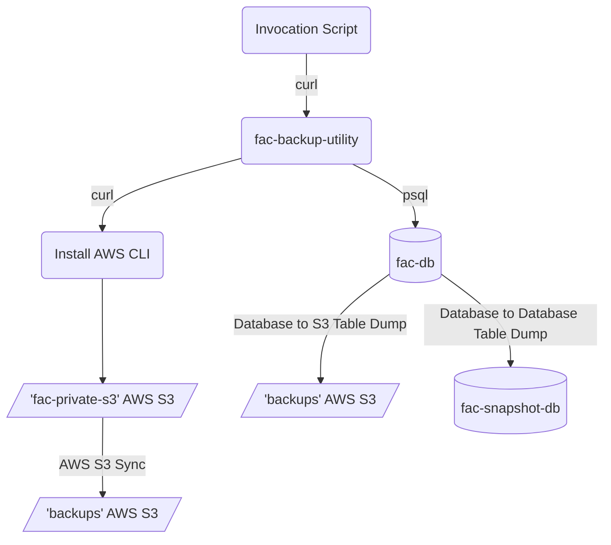
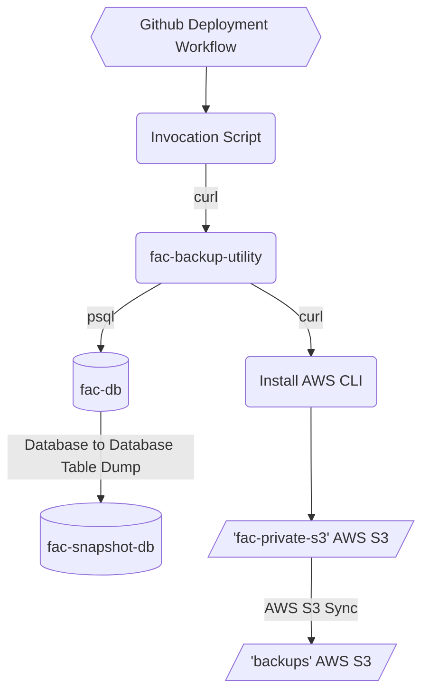
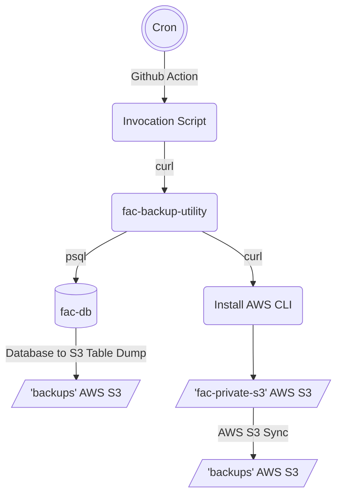

### Background
- The FAC team uses a lightweight go program to perform psql actions to backup the application database.
  - We store these backups in 2 locations, in 2 formats.
    - Format 1 is in a psql `.dump` format that is housed in an s3 bucket, taken during working hours of PST every 2 hours on a cron.
    - Format 2 is in a second database, taken before an application deployment.
- While normal operation of the backup utility is automated, events that require manual usage may occur. The tool can be run locally using docker containers, or on a cloud.gov application instance.
- Operations for the backup utility can be added to the backup utility [here](https://github.com/GSA-TTS/fac-backup-utility/tree/main/cmd) with invocation for the FAC done [here](https://github.com/GSA-TTS/FAC/blob/main/backend/fac-backup-util.sh)
- `${version}` refers to the latest version release from [FAC Backup Utility Releases](https://github.com/GSA-TTS/fac-backup-utility/releases), in format `vX.Y.Z`. The version is subject to change, but the most recent can always be found from the embedded link when attempting to use the utility.

### Available Commands
The following commands are referenced in the [bash script](https://github.com/GSA-TTS/FAC/blob/main/backend/fac-backup-util.sh) and can be used with the Backup Utility. More information below.
- initial_backup (Used if no backups have occured)
- deploy_backup (Used before deploying the application)
- scheduled_backup (Used every 2 hours on cron schedule)
- daily_backup (Unused at this time)
- media_sync (Available to explicitly sync 2 s3 buckets)
- check_tables (Performs a row count and table check against a manifest of tables)

### Database Backups
Information regarding the fac-backup-utility can be found [at the repository](https://github.com/GSA-TTS/fac-backup-utility).
Database backups occur in the following ways:
1. An initial backup, where a backup has not been run in the target environment. This input of `initial_backup` is important, as when it does a the `db_to_db` command, it will not truncate the target table, as the table does not exist in the destination database.
```bash
./fac-backup-util.sh ${version} initial_backup
# Curl the utility
# Install AWS
# DB to S3 table dump (backups)
# DB to DB table dump (fac-db -> fac-snapshot-db) [No Truncate, as tables dont exist]
# AWS S3 sync (fac-private-s3 -> backups)
```


2. A deploy backup, where the `db_to_db` function is not called. This is a standard backup strategy before the application deploys, to ensure the s3 contents of the primary s3 are sync'd to the backups bucket, and a table dump is stored in the backups bucket.
```bash
./fac-backup-util.sh ${version} deploy_backup
# Curl the utility
# Install AWS
# DB to DB table dump (fac-db -> fac-snapshot-db)
# AWS S3 sync (fac-private-s3 -> backups)
```


3. A scheduled backup is run every two hours, across each environment, ensuring that we have a clean backup in s3, rds, and the bucket contents are in sync.
```bash
./fac-backup-util.sh ${version} scheduled_backup
# Curl the utility
# Install AWS
# DB to S3 table dump (fac-db -> backups)
# AWS S3 sync (fac-private-s3 -> backups)
```


# Reference Documentation On Restores
The following section is no longer applicable for general usage. At the time of incorporation of the backup utility, we the FAC team opted to not give the utility full autonomy on the restoration effort. The purpose of this was to class the main application database as a _protected_ database, and not allow the utility to perform operations targeting it. We determine any restoration effort to require some degree of manual intervention. While the [Backup Utility](https://github.com/GSA-TTS/fac-backup-utility) can be used for a restoration, we do need to agree to it as a team norm.

### Restoring
1. S3 Restore takes a `operation-mm-DD-HH` input (ex `scheduled-06-04-10`), and is required for the backups to be restored. The utility looks in `s3://${bucket}/backups/operation-mm-DD-HH/` for its table dumps, and without supplying the target backups, it will not restore. Once it does a `--data-only` restoration, it will then sync the files from the backups bucket to the application bucket. We do this to ensure the contents of the application bucket are up to date, relative to the data in the database. We know that if we use the latest folder in `/backups/` then the contents of the s3 are the latest available, from the prior backup.
```bash
./fac-restore-util.sh ${version} s3_restore scheduled-06-04-10
# Curl the utility
# Install AWS
# DB to S3 table dump (backups -> fac-db) [Truncate target table before --data-only pg_restore]
# AWS S3 sync (backups -> fac-private-s3)
```
Potential Options for restoration:
```bash
initial-YYYYmmddHHMM
scheduled-mm-dd-HH
daily-mm-dd
```

2. Database to database restoration also can occur as well, using `psql` to dump the tables from the cold store database to the live database.
```bash
./fac-restore-util.sh ${version} db_restore
# Curl the utility
# Install AWS
# DB to DB table dump (fac-snapshot-db -> fac-db) [Truncate target table before dump]
# AWS S3 sync (fac-private-s3 -> backups)
```
