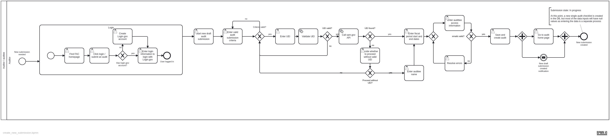
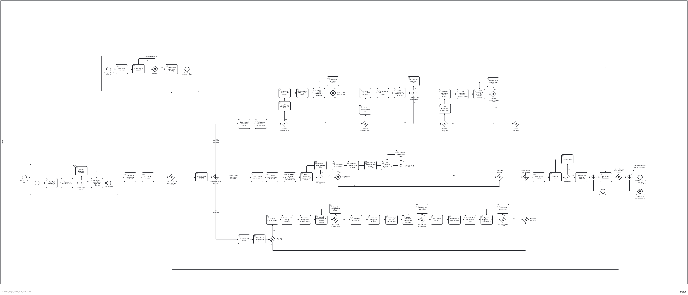
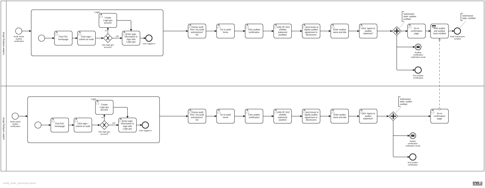
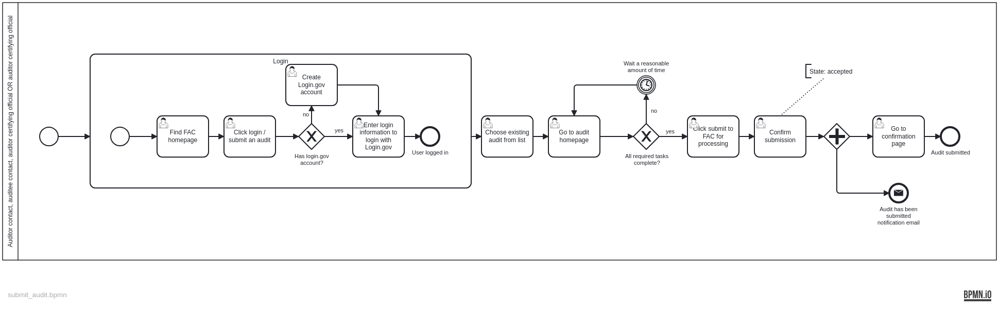

## What this is
We’ve modeled single audit submission workflows using the [business process model and notation (BPMN)](https://www.omg.org/spec/BPMN/2.0/). BPMN is a standard notation for diagramming processes. 

## Goals
 - To facilitate conversations and decisions regarding the design and development of single audit workflow by making workflow and process logic explicit
 - To bootstrap software development by helping developers outline and understand relationships among objects and information in the workflow. 

## To edit a model
1. Open the `.bpmn` file in a BPMN modeling tool. ([bpmn.io](https://bpmn.io/) works in your web browser, and there are plenty of other BPMN modeling tools to choose from.)
1. Make a pull-request with your changes

## Model inventory

### create_new_submission
**Description:** This model covers the creation of a new audit submission. Users first check that the entity meets the single audit criteria for the audit period, check the UEI against SAM.gov, enter fiscal period start and end dates, confirm or provide the entity name, and assign necessary contacts and roles.

**Process trigger:** Single audit deadline approaching 

**End state:** new submission created; a new single audit checklist is created in the database, but most of the data inputs will have null values as entering the data is a separate process (complete_single_audit_data_entry). At the end of this process, the audit submission will be in the **In progress** state.

**Primary actor(s):** This workflow can be completed by just about anyone. We know from user research that it’s frequently the auditor who creates a new submission, but there are no permission-based restrictions  on who can create a new submission. 

### complete_single_audit_data_entry

**Description:** This model covers a user entering the data needed for an audit submission to be complete and ready for certification by the auditor and the auditee. By the end of this process, the audit report and all required sections of the SF-SAC are complete and valid. 

**Process trigger:**  Audit submission due soon. This process could also be triggered by an automated email message thrown at the end of the create_new_submission process. 

**End state:** Audit SF-SAC and audit report pdf completed/locked. The audit submission will be in the **needs certification** state.

**Primary actor(s):** This workflow can be completed by just about anyone who’s been given access to the submission as part of the create_new_submission process. Beyond that, there are no permission-based restrictions governing which of the users who’ve been granted access to the data can input the data.

**Limitations:** We know from user research that data entry is most often handled by someone at the auditing firm, and that’s what this model depicts. However, we also know  that data are not always entered during a single session, and that different people may come in at different times and input different pieces of information. This model doesn’t reflect that complexity. 

### certify_audit_submission

**Description:** This model covers the process by which the auditor and auditee certifying officials certify completed submissions. By the end of this process, the audit will be certified by both certifying officials and is ready to be submitted. 

**Process trigger:** Audit submission due soon. This process could also be triggered by an automated email message thrown at the end of the complete_single_audit_data_entry process. 

**End state:** The audit submission is certified. The audit submission  will be in the **certified** state.

**Primary actor(s):** Permissions for this workflow are restricted to the individuals named as auditor certifying official and auditee certifying official as part of the create_new_submission process. 

### submit_audit

**Description:** This model covers the process by which a complete, certified submission is submitted to the FAC. 

**Process trigger:**  Audit submission due soon. This process could also be triggered by an automated email message thrown at the end of the certify_audit_submission process. 

**End state:** Single audit is submitted to the FAC. The audit submission  will be in the **accepted** state.

**Primary actor(s):** This workflow can be completed by just about anyone who’s been given access to the submission as part of the create_new_submission process. Beyond that, there are no permission-based restrictions governing which of the users who’ve been granted access to the submission can submit. 

