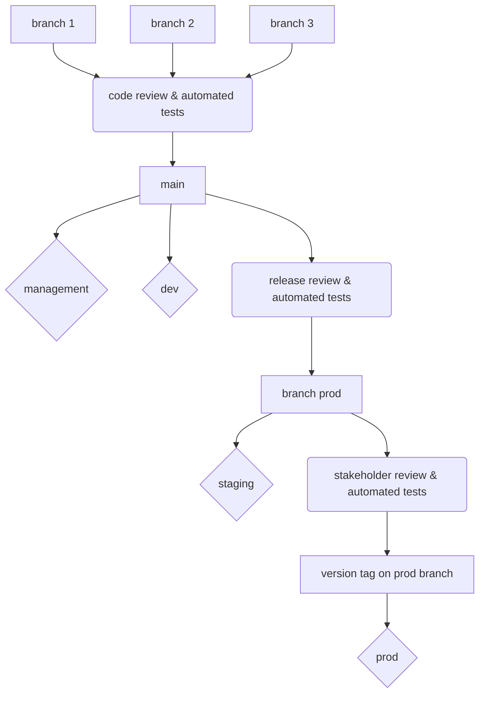
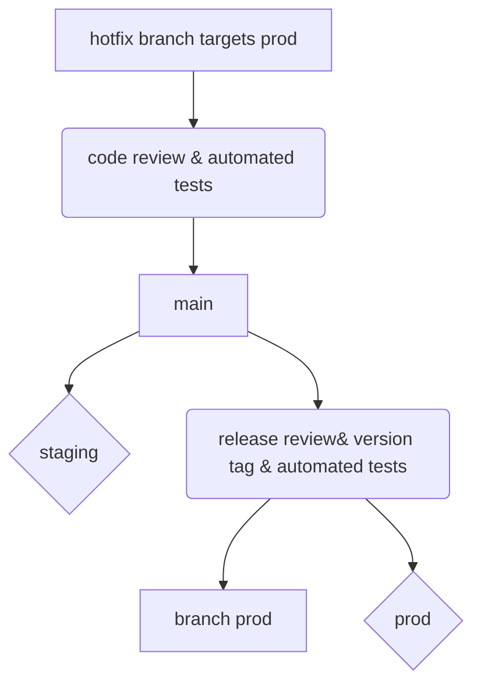
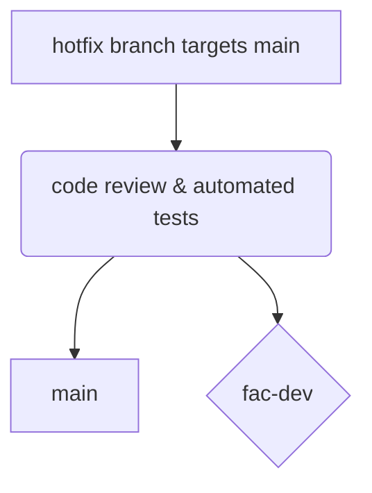

# Branching strategy 

We are using a [OneFlow variation](https://www.endoflineblog.com/oneflow-a-git-branching-model-and-workflow#variation-develop-master). This is an approach to keep up the speed of development and be able to identify what code is deployed quickly and easily. We want to keep PRs to `main` small, manageable and continuous. Staging releases on the `prod` branch allow for a stable branch to preview so that stakeholders and people who are providing the relevant quality checks can review the release. Then, the main branch is deployed to Prod using protected tags.

There are two long-lived branches:
 - `main` this is where work starts and this branch is automatically deployed to develop
 - `prod` this branch auto-deploys to staging

 There are four environments. Three app environments and a management environment for things like storing shared configs for the app spaces.

 Three app environments:
 - dev [https://fac-dev.app.cloud.gov/](https://fac-dev.app.cloud.gov/)
 - staging [https://fac-staging.app.cloud.gov/](https://fac-staging.app.cloud.gov/)
 - production [https://app.fac.gov/](https://app.fac.gov/) production is auto-deployed by using version tags
 

## Timeline
Week |Monday |Tuesday |Wednesday |Thursday |Friday
--|--|--|--|--|--
Week 1 | | |Merge changes into the `prod` branch to deploy to staging | |
Week 2 | | |Once approved, a maintainer pushes a version tag to deploy to production | Sprint ends |Next Sprint begins|

## Standard development flow



### Steps:
1. Start a branch from `main` for new work commit changes. When your work is ready, rebase to `main` and clean your commit history. When acceptance criteria is met and tests pass, create a pull request that targets the `main` branch. Make sure that the commits in your pull request are **signed** ([follow these steps](#signed-commits)). The terraform plan for the dev environment will be created as part of the PR. Tag one or more relevant people for review.
2. Branch is ready for review. The reviewer will test locally for acceptance criteria, readability, security considerations, and good testing practices. Don't review your own PR. Once the PR is merged into the `main` branch, after tests pass, any changes to the management or dev spaces via terraform will be applied, and the code will deployed to the dev environment.
3. When its time to create a release for review, we will add those changes to `prod` via PR. Merging to the `prod` branch will deploy the code to staging after tests pass.
4. The release is reviewed by stakeholders. When it is ready for production, an OROS approver will add a version tag starting with "v". The tag will trigger an automated deploy to production. There is a GitHub rule to enforce that only "maintainer" role are allowed to add tags starting with "v." 
5. Any changes that are made directly on the `prod` branch will need to be merged back into the `main` branch with a PR. 

### Mechanics
Our tests and deploys are kicked off from trigger files in [.github/workflows](https://github.com/GSA-TTS/FAC/blob/main/.github/workflows) that then call out the appropriate scripts.

### Tips
- To help other know who to talk to about a branch, add initials to your branch name.
- To help other understand the context for a branch, include the ticket number in the branch name.
- To minimize conflicts, DO NOT squash merge PRs to the `prod` branch or PRs from the `prod` branch back into `main`.
- You can add follow-tags to your git config to make it easier to push tags.
`git config --global push.followTags true`

See [testing.md](https://github.com/GSA-TTS/FAC/blob/main/docs/testing.md) for details about what tests are run when.

## Hotfix contingency flow
Solve the problem quickly, and methodologically

Make sure changes are added to `main`


### Steps:
1. Start a branch from the up to date `prod` branch and commit changes the fix on a branch pre-fixed with `hotfix\`. Target the `prod` branch with a PR. When acceptance criteria is met and tests pass, create another pull request that targets `main`.
2. When the branch is ready for review. Test locally for acceptance criteria, look for readability, security considerations, and good testing practices. Don't review your own PR. Once merged into `prod` This will auto deploy to the staging environment after tests pass.
3. The hotfix is reviewed by stakeholders in the staging environment. When it is ready for production, a GitHub maintainer will add a version tag starting with "v".  The tag will trigger an automated deploy to production. There is a GitHub rule to enforce that only `maintainer` role are allowed to add tags starting with "v."
4. Changes need to be merged back into the `main` branch.

## Signed Commits

Commits are required to be signed prior to being formed into a PR and merged into `main`. We use GPG keys to verify these commits. You can complete the following steps to ensure your commits are verified.

### Setup

You can install GnuPG [here](https://gnupg.org/download/index.html) to gain access to the CLI commands below.

### CLI Instructions

```
1. Generate a new GPG Key
gpg --full-generate-key
Press Enter for Default key
Press Enter for default keysize
Enter Expiration (0)
Enter your name
Enter your github @noreply email to keep your account email private (https://github.com/settings/emails)

2. Get your GPG key
gpg --list-secret-keys --keyid-format=long
gpg --armor --export <keyid>

3. Copy your Key and add it to git gpg keys (https://github.com/settings/keys)
-----BEGIN PGP PUBLIC KEY BLOCK-----
....
-----END PGP PUBLIC KEY BLOCK-----

4. Tell git about your key
git config --global --unset gpg.format
gpg --list-secret-keys --keyid-format=long
Get your keyid (should be the same as step 2)
git config --global user.signingkey <keyid>
git config --global commit.gpgsign true

# For windows users only:
git config --global gpg.program "C:\Program Files (x86)\GnuPG\bin\gpg.exe"

NOTE: You will now have to enter your gpg passcode in order to do a commit (Yes, even git fork prompts for a pass now). Keep it handy or easy for you to remember while still being complex
```

---
**NOTE**

Before doing anything with git, use gpg --sign on some file to make sure that the signing machinery is currently working for you. This should only apply if you have already created some commits without completing the above steps to configure your GPG key.
```
gpg --sign <some file>
git checkout <your branch>
git log --reverse --show-signature
git rebase -i HEAD~<numeral indicating number of commits you need to sign>
```
This is sample output:
```
pick d3381defc Change backend so that it converts user-submitted UEIs to uppercase.
pick 679acdde6 Really unsubtle approach to uppercasing the UEI on the frontend.
pick 45eeb61bb Prettier linting.
pick 5d676ca90 Prettier linting.
```
Add `exec git commit --amend --no-edit -s` after every pick line, changing it to something like this:
```
pick d3381defc Change backend so that it converts user-submitted UEIs to uppercase.
exec git commit --amend --no-edit -s
pick 679acdde6 Really unsubtle approach to uppercasing the UEI on the frontend.
exec git commit --amend --no-edit -s
pick 45eeb61bb Prettier linting.
exec git commit --amend --no-edit -s
pick 5d676ca90 Prettier linting.
exec git commit --amend --no-edit -s
```
This will rebase your branch; if there are errors you’ll end up in an intermediate state and will need to do git rebase --continue after fixing them.
Once that’s done, push the branch again:
```
git push --force origin <your branch>
```

Your existing commits should now be signed as well as your new commits moving forward.
