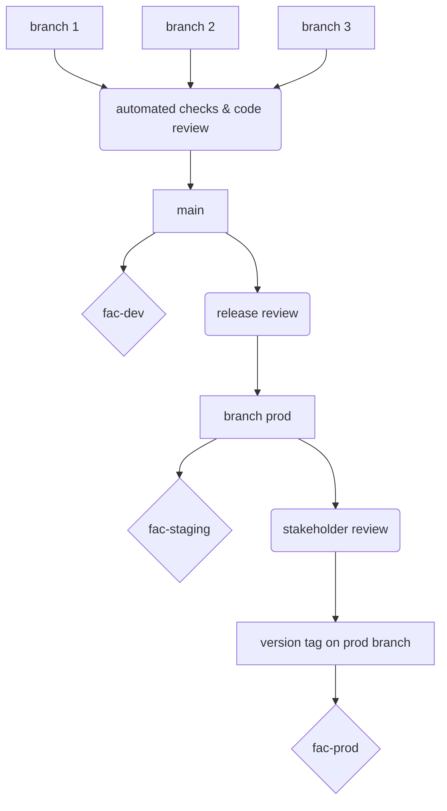
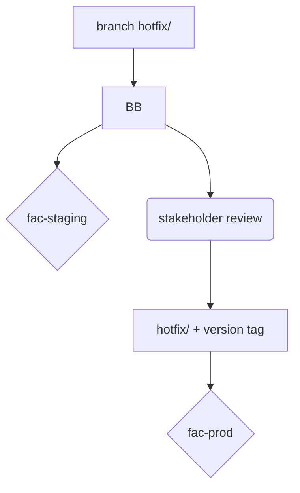

# Branching strategy 

[OneFlow](https://www.endoflineblog.com/oneflow-a-git-branching-model-and-workflow#variation-develop-master) is an approach to keep up the speed of development. That is helps keep PRs small and manageable. Staging releases allow for a stable branch to preview so that stakeholders and people who are providing the relevant quality checks can review the release. Then, the main branch can be deployed to Prod using protected tags.

There are two long-lived branches:
 - `main` this is where work starts and this branch is automatically deployed to develop
 - `prod` this branch auto-deploys to staging

 There are three environments:
 - dev [https://fac-dev.app.cloud.gov/](https://fac-dev.app.cloud.gov/)
 - staging [https://fac-staging.app.cloud.gov/](https://fac-staging.app.cloud.gov/)
 - production [https://fac-prod.app.cloud.gov/](https://fac-prod.app.cloud.gov/) production is auto-deployed by using version tags

## Standard development flow

### Steps:
1. Start a branch from `main` for new work commit changes. When your work is ready, rebase to `main` and clean your commit history. When acceptance criteria is met and tests pass, create a pull request that targets `main`. Tag one or more relevant people for review.
2. Branch is ready for review. Test locally for acceptance criteria, look for readability, security considerations, and good testing practices. Don't review your own PR.
3. When we want to create a release for review, we will create a branch `prod`. This will deploy to staging when tests pass.
4. The release is reviewed by stakeholders. When it is ready for production, an OROS approver will add a version tag starting with "v". Any changes need to be merged back into the `main` branch. The tag will trigger an automated deploy to production. There is a GitHub rule to enforce that only `maintainer` role are allowed to add tags starting with "v."

## Hotfix contingency flow

### Steps:
1. Start a branch from the up to date `prod` branch and commit changes the fix on a branch pre-fixed with `hotfix\`. Target the `prod` branch with a PR. When acceptance criteria is met and tests pass, create a pull request that targets `main`.
2. Branch is ready for review. Test locally for acceptance criteria, look for readability, security considerations, and good testing practices. Don't review your own PR. Once merged into `main` This will auto deploy to the staging environment.
3. The hotfix is reviewed by stakeholders. When it is ready for production, an OROS approver will add a version tag starting with "v". Changes need to be merged back into the `main` branch. The tag will trigger an automated deploy to production. There is a GitHub rule to enforce that only `maintainer` role are allowed to add tags starting with "v."

## Timeline
Week |Monday |Tuesday |Wednesday |Thursday |Friday
--|--|--|--|--|--
Week 1 | | |Create a `release/...` branch to deploy to staging | |
Week 2 | | |Merge the `release/...` branch into `master` to deploy to production | Sprint ends |Next Sprint begins|
