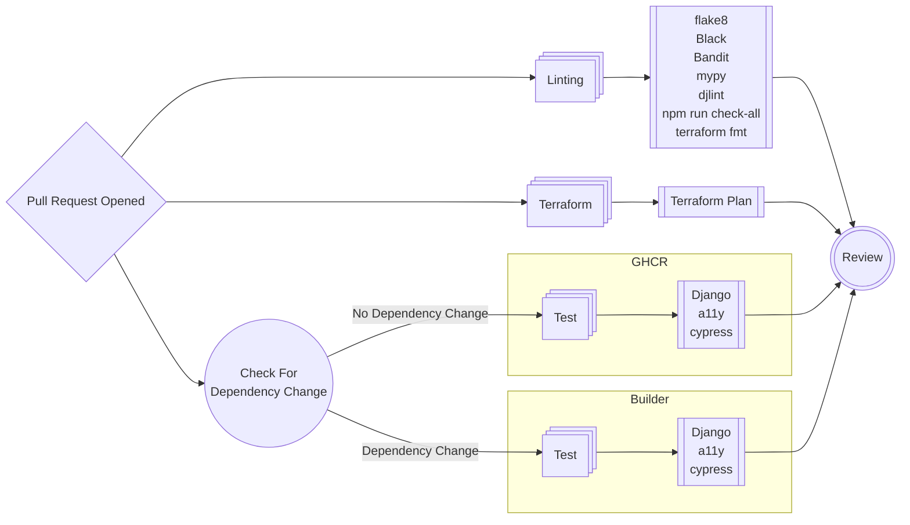
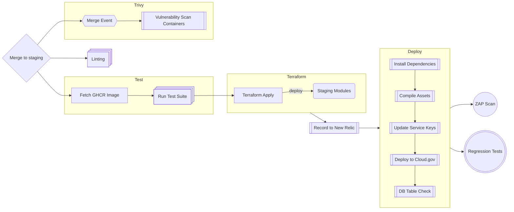
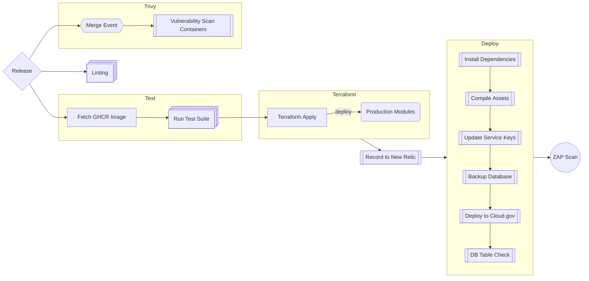
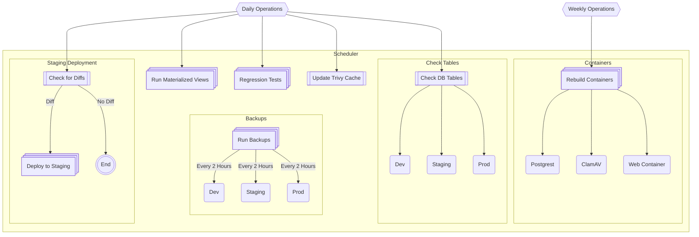

## CI/CD Operations

### Introduction
We use a variety of CI/CD mechanisms in the FAC, largely surrounding terraform and github workflows. Inside those mechanisms, there are various items that serve to handle our process of testing, scanning, and deploying. This document is considered a living document and should be updated as new mechanisms or items are introduced.

### Development
Largely, the scope of operations can be viewed in the below graph, which illustrate how a new piece of code, feature or implementation may be introduced to the ecosystem. A developer will take on a task, work on that task locally, create a pull request, that pull request will be tested, it is approved, and then merged into dev, automatically merged into staging the following day, and then released to production once a week, with ad-hoc releases also acceptable.

### Pull Requests
By and large, when a pull request has been opened, one of the two above paths has been tested to qualify it as Pull Request ready. We follow a similar path to manual local testing when a PR opens, however, the underlying system is slightly different depending on what has been done. If a PR does not change core dependencies, then it will run necessary tests using the current [GHCR container](https://github.com/GSA-TTS/FAC/pkgs/container/fac%2Fweb-container), and after merging, it will rebuild and overwrite it. If a PR does change dependencies, the GHCR version is ignored, and all tests run on a builder.

### Deployments
When a PR is approved and ready to merge, a bunch of processes are triggered to again, validate all operational components related to a deployment. Some of these operations are redundant, but they ensure that the new code base does not cause any conflict in any way. We operate under the assumption that if it passes in the pull request, we have high stability, however we run them again as a means to attempt to catch any outliers.

While all environments generally deploy the same way, it is heavily front-loaded in the dev environment. Staging differs slightly:

And production differs in the the removal of regression tests, with a supplemental deployment step:

### Automated Tasks
Automated tasks are run on a schedule daily, with the exception of the backup operations in each environment, which run every 2 hours during operational times (EST Start) -> (PST End of Day).

### CI/CD Map
Detailed below is a reference to, with a description of, each of our various components.

**Ops:**
* [Auto Merge Staging PR](../.github/workflows/auto-merge-staging-pr.yml)
    * This works in parallel with [Create PR to Staging](../.github/workflows/create-pull-request-to-staging.yml) as a means to automate staging merges. This approves the PR with a PAT.
* [Build Docker Container](../.github/workflows/build-docker-container.yml)
    * This workflow does a `docker build` on our system, much like if you were performaing this locally, gives the container a tag, and then pushes it to GHCR.
* [Create PR to Staging](../.github/workflows/create-pull-request-to-staging.yml)
    * This checks to see if there has been a commit in 24 hours, and if so, creates a pull request, tags it, and then approves it with the Github secret access token [GITHUB_TOKEN](https://docs.github.com/en/enterprise-server@3.16/actions/security-for-github-actions/security-guides/automatic-token-authentication#about-the-github_token-secret).
* [Create Release](../.github/workflows/create-release.yml)
    * Largely unused, but autofills a changelog and generates a release with a tag `v1.YYYYMMDD`. This can be updated to automatically release on a scheduled cron.
* [Pull & Push Containers to GCHR](../.github/workflows/pull-containers-and-push-to-ghcr.yml)
    * Pulls the latest ClamAV & Postgrest container from their respective sources, scans them with [Aquasecurity's Trivy](https://github.com/aquasecurity/trivy), and then publishes to our GHCR.
* [Terraform Plan](../.github/workflows/terraform-plan-env.yml)
    * Used to create a terraform plan on pull requests to illustrate what operations will be performed when merging to a specific environment, impacting changes on the infrastructure.
* [Terraform Apply](../.github/workflows/terraform-apply-env.yml)
    * Used to run a terraform app on merge events to execute the operations generated in a pull requests plan to a specific environment, impacting changes on the infrastructure.
* [Trivy](../.github/workflows/trivy.yml)
    * Runs [Aquasecurity's Trivy](https://github.com/aquasecurity/trivy) against our containers.
* [Trivy Cache Updater](../.github/workflows/trivy-cache.yml)
    * Rebuilds the vulnerability database for Trivy and stores in the Github Cache
* [ZAP](../.github/workflows/zap-scan.yml)
    * Crawls a live environment with [ZAP](https://www.zaproxy.org/) using our [configuration](../zap.conf).

**Testing:**
* [Cypress Test (Container)](../.github/workflows/cypress-testing-from-container.yml)
    * This sets up everything necessary for cypress to run in a headless environment, on a github runner that enables it to run as a pull request check.
* [Cypress](../.github/workflows/regression-tests.yml)
    * This file handles all non-container run tests using Cypress against a live environment.
* [Daily Regressions Tests](../.github/workflows/daily-regression-tests.yml)
    * A lightweight cron and caller file that invokes a regression test run on `staging` daily.
* [Lint](../.github/workflows/linting.yml)
    * Used to perform linting across the board for main application code and fail if necessary, preventing a merge/deploy if there are errors.
* [Lint (Terraform)](../.github/workflows/terraform-lint.yml)
    * Used to perform linting on terraform specific files.
* [Pull Request Checks](../.github/workflows/pull-request-checks.yml)
    * All logic used to perform tests and ensure that a pending pull request can be eligable to merge into a branch.
* [Testing From Build](../.github/workflows/testing-from-build.yml)
    * Runs the test suite on a built docker container. Used when there are changes to core dependencies (`requirements.txt`, `dev-requirements.txt`, `Dockerfile`, `package.json` and `static files`).
* [Testing From GHCR](../.github/workflows/testing-from-ghcr.yml)
    * Runs the test suite against the previous versions published container in GHCR if there are no changes to core dependencies.

**Deployments:**
* [Deploy Application](../.github/workflows/deploy-application.yml)
    * This workflow is the basis for deploying an application to any environement, starting by setting up all necessary dependencies and then deploying to cloud.gov. It is called by multiple files, based on the environment that is set to deploy.
* [Deploy Development](../.github/workflows/deploy-development.yml), [Deploy Preview](../.github/workflows/deploy-preview.yml), [Deploy Staging](../.github/workflows/deploy-staging.yml) and [Deploy Production](../.github/workflows/deploy-production.yml)
    * The main caller files that describe the steps necessary for a workflow run to deploy a specific environment. Only small changes differ between these files.
* [Record Deployment on New Relic](../.github/workflows/new-relic-deployment.yml)
    * Creates a "marker" on the New Relic activity chart, accessible via the New Relic application, to signify that a deployment has occured.
* [Staging Scheduled Deployment](../.github/workflows/staging-scheduled-deploy.yml)
    * Necessary steps to ensure code from main(dev) is eligable to move to the prod(staging) environment.

**Data:**
* [Backup Scheduler](../.github/workflows/fac-backup-scheduler.yml) and [Run Backups on Schedule](../.github/workflows/fac-backup-util-scheduled.yml)
    * These work in parallel to invoke the [FAC Backup Utility](https://github.com/GSA-TTS/fac-backup-utility) via a [bash script](../backend/fac-backup-util.sh) to perform an RDS table backup and S3 content backup every 2 hours during EST Start of Day and PST End of Day.
    * [FAC Backup Util](../.github/workflows/fac-backup-util.yml) invokes the [FAC Backup Utility](https://github.com/GSA-TTS/fac-backup-utility) via a [bash script](../backend/fac-backup-util.sh) on demand.
* [Check Tables Scheduler](../.github/workflows/fac-check-tables-scheduler.yml) and [Check Tables](../.github/workflows/fac-check-tables.yml)
    * These work in parallel to invoke the [FAC Backup Utility](https://github.com/GSA-TTS/fac-backup-utility) via a [bash script](../backend/fac-backup-util.sh) to perform a table check on the RDS using a manifest to determine if there are any discrepancies in our tables (missing, lost, untracked).
* [Export to CSV](../.github/workflows/export-data-to-csv.yml)
    * Invokes a django command to [export data](../backend/support/management/commands/export_data.py) to CSV format.
* [Materialized Views](../.github/workflows/materialized-views.yml)
    * Calls the Django function [materialized views](../backend/dissemination/management/commands/materialized_views.py) to run the [create materialized views](../backend/dissemination/sql/create_materialized_views.sql) sql.

**Unused:**
* [BPMN Renders](../.github/workflows/add-bpmm-renders.yml)
    * This is no longer used, but in the event of BPMN diagrams being updated, this can be incorporated back into the operations.
* [Destroy and Regenerate Dissemination](../.github/workflows/destroy-and-regenerate-dissemination.yml)
    * This is no longer used, and in the event it needs to be used, can only be run by select accounts. Update the conditional accordingly `if: contains('["user1","user2"]', github.actor)`.
* [E2E Test](../.github/workflows/end-to-end-test.yml)
    * This is a stray workflow and can be deleted. Superceded by Cypress Workflows.
* [Failed Data Migration Processor](../.github/workflows/failed-data-migration-reprocessor.yml) and [Historic Data Migration Processor](../.github/workflows/historic-data-migrator-with-pagination.yml)
    * This is no longer used, but was done as a means to generate and disseminate historic data in a target environment.

