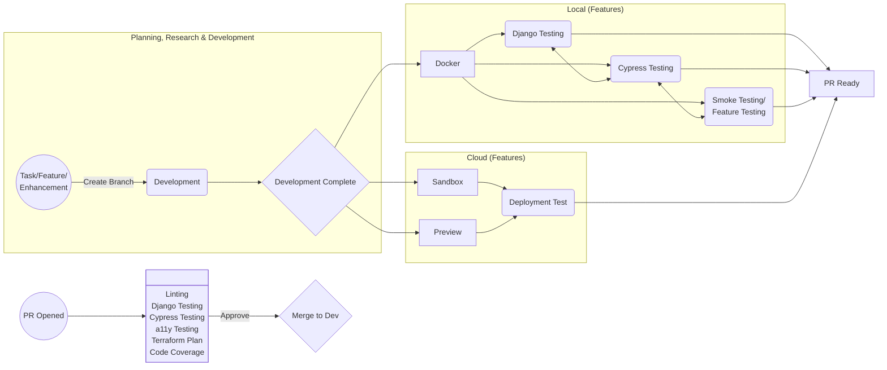
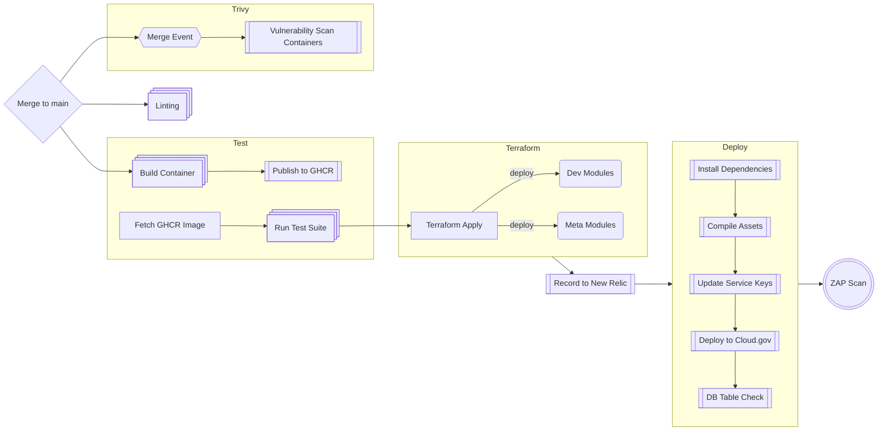
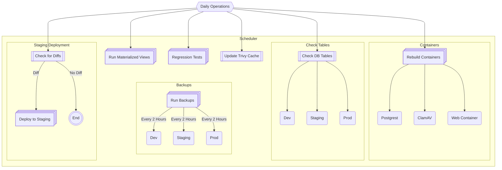

## CI/CD Operations

**Introduction:**
We use a plethora of CI/CD mechanisms in the FAC, largely surrounding terraform and github workflows. Inside those mechanisms, there are various items that serve to handle our process which revolve around testing, scanning, and deploying. This document is considered a living document and should be updated as new mechanisms or items are introduced.

**Development Overview:**
Largely, the scope of operations can be viewed in the below graph, which illustrate how a new piece of code, feature or implementation may be introduced to the ecosystem. A developer will take on a task, work on that task locally, create a pull request, that pull request will be tested, it is approved, and then merged into dev, automatically merged into staging the following day, and then released to production once a week, with ad-hoc releases also acceptable.

**Pull Request Overview:**
By and large, when a pull request has been opened, one of the two above paths has been tested to qualify it as Pull Request ready. We follow a similar path to manual local testing when a PR opens, however, the underlying system is slightly different depending on what has been done. If a PR does not change core dependencies, then it will run necessary tests using the current [GHCR containter](https://github.com/GSA-TTS/FAC/pkgs/container/fac%2Fweb-container), and after merging, it will rebuild and overwrite it. If a PR does change dependencies, the GHCR version is ignored, and all tests run on a builder.

**Deployments:**
When a PR is approved and ready to merge, a bunch of processes are triggered to again, validate all operational components related to a deployment. Some of these operations are redundant, but they ensure that the new code base does not cause any conflict in any way. We operate under the assumption that if it passes in the pull request, we have high stability, however we run them again as a means to attempt to catch any outliers.

While all environments generally deploy the same way, it is heavily front-loaded in the dev environment. Staging differs slightly

And production differs in the the removal of regression tests, with a supplemental deployment step

**Automated Tasks:**
Automated tasks are run on a schedule daily, with the exception of the backup operations in each environment, which run every 2 hours during operational times (EST Start) -> (PST End of Day).

