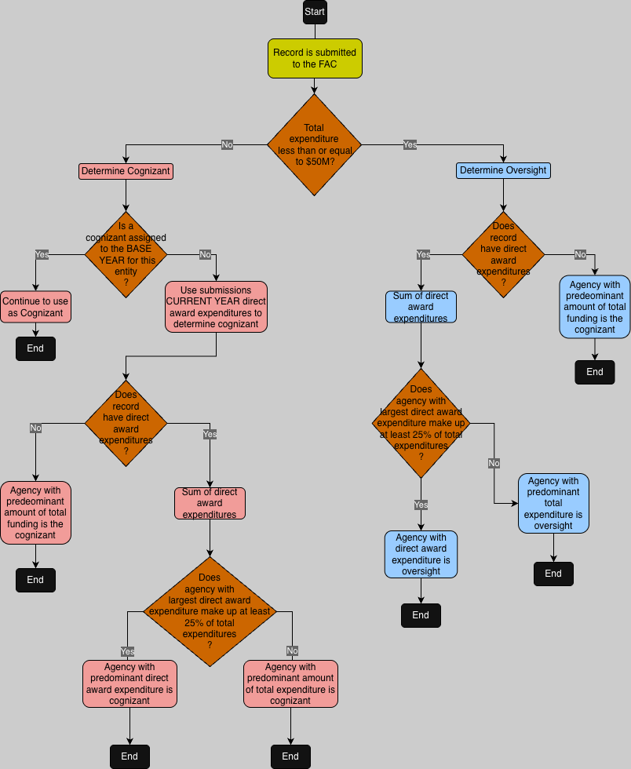

# Determining the Cognizant and Oversight Agency

This document describes the algorithm used to determine agency cognizance or oversight for audits submitted to the FAC.  
**[This algorithm](https://github.com/GSA-TTS/FAC/blob/main/backend/support/cog_over.py)** is implemented in code, automatically executing for every GSA FAC submission, and is guided by the **[Code of Federal Regulation (CFR) 200.513](https://www.ecfr.gov/current/title-2/subtitle-A/chapter-II/part-200/subpart-F/subject-group-ECFRed80de82be1f4a3/section-200.513)**.

## Table of Contents
- [What is a Cognizant or Oversight Agency?](#what-is-a-cognizant-or-oversight-agency)
  - [How Continuity of Cognizance Works?](#how-continuity-of-cognizance-works)
- [compute_cog_over Algorithm](#compute_cog_over-algorithm)
- [Example of Cognizant Agency calculation and assignment](#example-of-cognizant-agency-calculation-and-assignment)
- [Decision Workflow](#decision-workflow)

## **What is a Cognizant or Oversight Agency?**

The Cognizant Agency for an audit is the main Federal agency responsible for overseeing the audit of a non-Federal recipient that spends more than $50 million annually in Federal awards. This agency ensures that audits are done correctly and efficiently. They provide guidance and coordinate audit decisions when findings affect multiple Federal programs.

If a Cognizant Agency is **not** designated, the Oversight Agency steps in. This typically happens when a non-Federal recipient spends less than or equal to $50 million annually. This agency provides similar support to a cognizant but has a lighter role unless otherwise needed.

### **How Continuity of Cognizance Works?**

- **Recalculation Every Five Years:**
  - In addition to the rules above, once an agency is assigned as a Cognizant Agency for the non-Federal recipient it remains in that role for a while. Changing of the Cognizant Agency happens once every 5 years starting from 2019, and continues in 2024, 2029, 2034, and so on. This prevents constant changes and provides stability.

- **Reassignment:**
  - A Federal agency can request reassignment to another Federal agency that provides substantial funding to the recipient.  Both the old and new cognizant agencies must notify the recipient, the auditor, and the FAC of the change within 30 days.

## **compute_cog_over Algorithm**

**GIVENS:**
- **federal_awards**
- **submission_status**
- **auditee_ein**
- **auditee_uei**
- **audit_year**

**RETURNS:**  
A tuple of **(cog, over)** values. If cognizant is assigned, then oversight will be None, and vice-versa.

1.  If there are no **federal_awards**
    1. Return **(None, None)** for  **(cog, over)**. This is an error condition.
    1. Validations prevent the submission of audits with no **federal_awards**

2.  Set **total_amount_expended** to the total of the **amount_expended** field in all **federal_awards**.

3.  Set **max_total_agency** and **max_da_agency** to hash tables computed by **[calc_award_amounts](https://github.com/GSA-TTS/FAC/blob/main/backend/support/cog_over.py#L78)**:
    1. **max_total_agency** is a hash table that keys the agency number to the total **amount_expended** for every **program** for the agency.
    1. **max_da_agency** is a hash table that keys the agency number to the amount expended for the awards where **is_direct** is **Y** for that agency.
    1. Those hash tables are then pruned, so that only the maximum values are kept. If there are ties (e.g. two agencies have the same, maximum-value expenditures), then both are kept.

4.  **agency** is computed using **[determine_agency](https://github.com/GSA-TTS/FAC/blob/main/backend/support/cog_over.py#L92)**. It uses **total_amount_expended** and the two hash tables computed in the previous step.
    1. For each agency and expenditure in the **max_da_agency** hash table, we ask if the total direct awards expended are greater than 25% of the **total_amount_expended**. If so, we put the agency into a **tie_breaker** hash table, keying the agency number to the **direct_awards** added to the corresponding value from **max_total_agency**.
    1. This is then pruned, so only maximum values are kept.
        - We try and return the agency who won the tiebreaker, by returning the max value from the **tie_breaker** hash table.
        - If we did not have any ties, we return the maximum from the **max_total_agency** hash table, computed in the previous step.
5.  If the **total_amount_expended** is less than or equal to the **COG_LIMIT** (which is $50M)
    1. The **agency** computed in the previous step is returned as the Oversight Agency. We return the tuple **(None, agency)**, meaning there is no cognizant but there is oversight. **We exit the algorithm if an Oversight Agency is assigned**.
6.  If no Oversight Agency was assigned, then we continue. The agency is now determined by the **[determine_hist_agency function](https://github.com/GSA-TTS/FAC/blob/main/backend/support/cog_over.py#L103)**, which uses the **auditee_ein**, **auditee_uei**, and **audit_year**:
    1. First, we calculate the **[base_year](https://github.com/GSA-TTS/FAC/blob/main/backend/support/cog_over.py#L64)**. For years 2019–2023, this is 2019. For years 2024–2028, this is 2024, and so on.
    1. If we are in the **FIRST_BASELINE_YEAR**, that means we have to use **[the dbkey to hash values; this is computed](https://github.com/GSA-TTS/FAC/blob/main/backend/support/cog_over.py#L130)** via hash against both the published data in the GSAFAC as well as the migration inspection records.
    1. **cog_agency** is then computed using the function **[lookup_latest_cog](https://github.com/GSA-TTS/FAC/blob/main/backend/support/cog_over.py#L154)**:
        - We look at our disseminated data for audits matching **auditee_ein** and **auditee_uei** for all audits with an audit year between **base_year** and and the **audit_year** of the audit being evaluated.
        - We reverse order, and take the **cognizant** value from the most recent submission matching. There might not be one.
    1. If we found a **cog_agency** in the previous step, we return this and return it as the historical agency. We then return **(cog_agency, None)** as a tuple. **This exits the algorithm**.
7.  If no historical agency was found in step 6, we set **cognizant_agency** to the same value as **agency** computed in step 4, and return the tuple **(cognizant, oversight)**. This may still be **(None, None)** which would be an error condition.

The nature of the algorithm is that we do not exit without a value for one of either **cog** or **over**. We expect, in all cases, that either the tuple **(cog, None)** will be returned, or **(None, over)**.

## **Example of Cognizant Agency calculation and assignment**

A non-Federal entity provides a service and the following government agencies grant them money to assist with services.  
For the sake of simplicity; the recipent is awarded and has expended the following amount below:
- Treasury Dept. awards them $50M "directly"
- GSA awards them $30M "directly" and  another $70M "indirectly".
- HUD also awards them $30M "directly" and another $80M "indirectly".
- HHS awards $20M "directly" and another $80M "indirectly".
- EPA grants $30M "directly" and another $10M "indirectly".

The total of all the money received is $400M, and Treasury Dept has granted the most direct money at $50M. It won't be the cognizant, however, because it contributed less than 25% of the total money awarded.  Instead, HUD would be the cognizant since it awarded the most total money "directly" and "indirectly".  

The following table illustrates the example:

| Agency             | Direct award (% of $400M) | Indirect award | Total from Agency |
|--------------------|:-------------------------:|:--------------:|:-----------------:|
| Treasury Dept.     |       $50M (12.5%)        |                |       $50M        |
| GSA                |        $30M (7.5%)        |      $70M      |       $100M       |
| HUD                |        $30M (7.5%)        |      $80M      |       $110M       |
| HHS                |        $20M (5.0%)        |      $80M      |       $100M       |
| EPA                |        $30M (7.5%)        |      $10M      |       $40M        |
| **Total Received** |                           |                |     **$400M**     |

## **Decision Workflow**

The following is a high level flowchart of the compute_cog_over algorithm:

