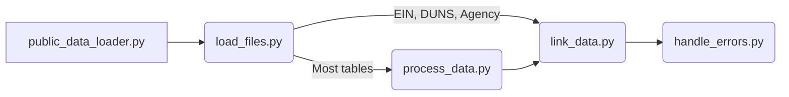

# Data loading

We have a script to load the public data.

Download data from https://facdissem.census.gov/PublicDataDownloads.aspx
Then unzip the files and place the them in data_distro/data_to_load/

Load them locally with: `manage.py public_data_loader`

It's a lot of data, so you might just want to run it against one of the cloud.gov instances. You can do that with task here is [an example](https://github.com/GSA-TTS/FAC/blob/main/backend/manifests/task-manifest-staging.yaml)

We are doing an initial data load in February 2022. There will be another round of data upload when we get the private data from Census and a mapping to the PDF files of reports. We will need to update data before launch to grab any records that have been added since the initial download work.

The upload script should be flexible enough to handle changes in the models that may happen between data loads.

#### Basic data loading flow diagram

Caveats:
* Errors from loading and linking will call functions handle_errors.py
* This depends on an up to date upload_mapping.py
* load_files depends on parse_config.py

### To refresh the data loading script

1) Look at the `make_table_structure` command. Make sure things like new_fields are up to date.
2) Rerun the `make_table_structure` management command to produce `new_upload_mapping.json`.
3) Check the outputs to make sure that things make sense. You will need to do a manual check on the upload mapping, If a data column needs to go to more than one model, that needs to be addressed in the upload script. For example, AUDITOR_EIN has the same info reported on two of the upload tables, so you only need to upload it once. Then, replace `data_distro/mappings/upload_mappings.json` with the new mapping.
4) Check the `public_data_loader` script. Renaming should mostly be handled by `upload_mapping` but changing relationships need to be accounted for in the script. Make sure the relationships that are in the `add_relational` output of `make_table_structure` are added in the script.
5) Run the `manage.py test_pandas` command to see if there are errors in the file that you need to manually fix.
6) Run the `manage.py public_data_loader` script. Each phase should tell you the number of expected objects from the table. For tables like general that should be 1:1 relationship for auditors, auditees and things that can be consolidated because of foreign to and many to many relationships, there will be fewer objects.

### To run the data loading script

I have been running the data loaders as tasks in cloud.gov. Loading from the all years download doesn't seem effectual. On some tables, Pandas gets parsing errors after running for a few hours. Instead, I have been running the downloads a few years at a time.

Check the `data_distro/data_to_load/run_logs` folder for error logs. This should tell you how many objects are expected and any errors in parsing or loading the data.

# Updating models for data_distro

If you update the name of a name or model in data_distro, you need to reflect that change over to the `mappings/upload_mappings.json` file. If you change model relationships, that will need to be reflected in the upload code, probably changing `link_data.py` and potentially `public_data_loader.py`. If you don't do these steps the data_distro tests should fail. Keeping mappings up to date should make it easier on ourselves later when we need to load more data.

Example commits where we updated names for [fields](https://github.com/GSA-TTS/FAC/pull/811/commits/a51391c58baf08109fd78f73cef0b76e279ddb9a) and [models](https://github.com/GSA-TTS/FAC/pull/811/commits/88bc46532cab9cc7281e60dff719ee81ccce95bb).

## Update docs

Create an updated csv data dictionary and add comments to the fields in postgres. Do that by running `manage.py create_docs`.

# Upload PDFs
Once we confirm we have all the PDFs and have data to link PDFs to their record, we can load PDFs to their respective public and private buckets. I created a management command that does the loading. You will need to update the logic to query for the id of the general record and the name of the PDF file. 