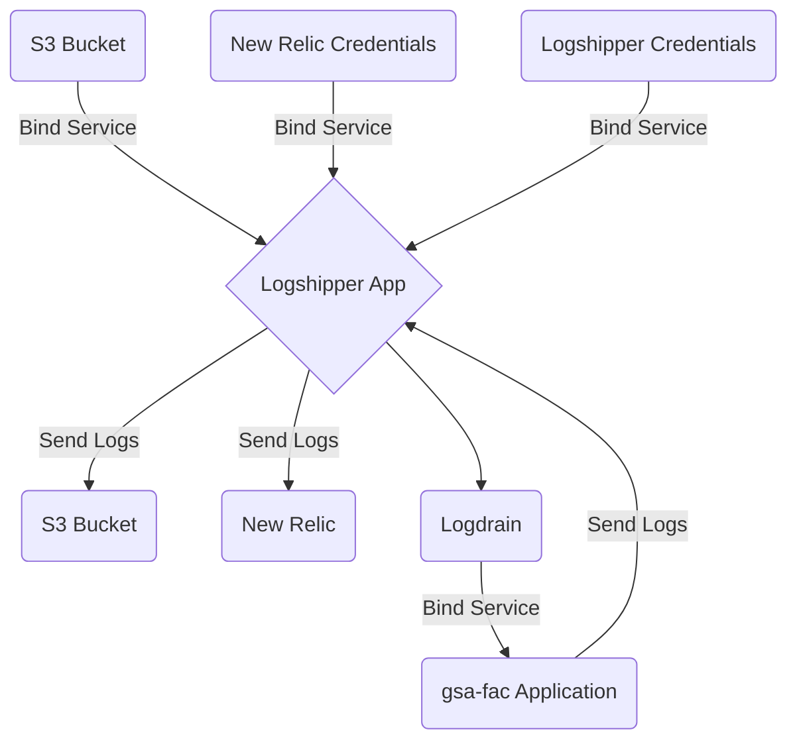

### **Sketch:**

### Key Components:
- Logshipper Credentials, defined as `cg-logshipper-creds` with a tag of `logshipper-creds` is populated as a random user/pass generated via terraform that signifies the `${HTTP_USER}` AND `${HTTP_PASS}` credential set for the `syslog_drain`
- New Relic Credentials, defined as `newrelic-creds` is not a new credential service, but has now been given a tag of `newrelic-creds` and a content of the logs uri endpoint, in addition to the existing credential contents
- The s3 bucket, defined as `log-storage` with a tag of `logshipper-s3` is a dedicated s3 bucket that's sole purpose is the ingest and storage of all `fluentbit` logs being sent. The credentials for this bucket, will be given to GSA SoC so that they may see the application metrics and logs.
- The logdrain service, defined as `fac-logdrain` is what is bound to the `gsa-fac` application, so that it may stream logs to the `cg-logshipper` application. It consists of a `syslog_drain` uri.

### Accepted Tags:
- Logshipper Credentials = `logshipper-creds`
- New Relic Credentials  = `newrelic-creds`
- S3 Bucket              = `logshipper-s3`

### Usage
```terraform
module "cg-logshipper" {
  source                = "<path/to/source>"
  name                  = local.logshipper_name
  cf_org_name           = var.cf_org_name   # gsa-tts-oros-fac
  cf_space_name         = var.cf_space_name # eg prod
  https_proxy           = module.https-proxy.https_proxy
  logshipper_instances  = #
  logshipper_memory     = #
  disk_quota            = #
  new_relic_id          = cloudfoundry_user_provided_service.credentials.id
}

resource "cloudfoundry_network_policy" "logshipper-network-policy" {
  policy {
    source_app      = module.cg-logshipper.app_id
    destination_app = module.https-proxy.app_id
    port            = "61443"
    protocol        = "tcp"
  }
}
```
