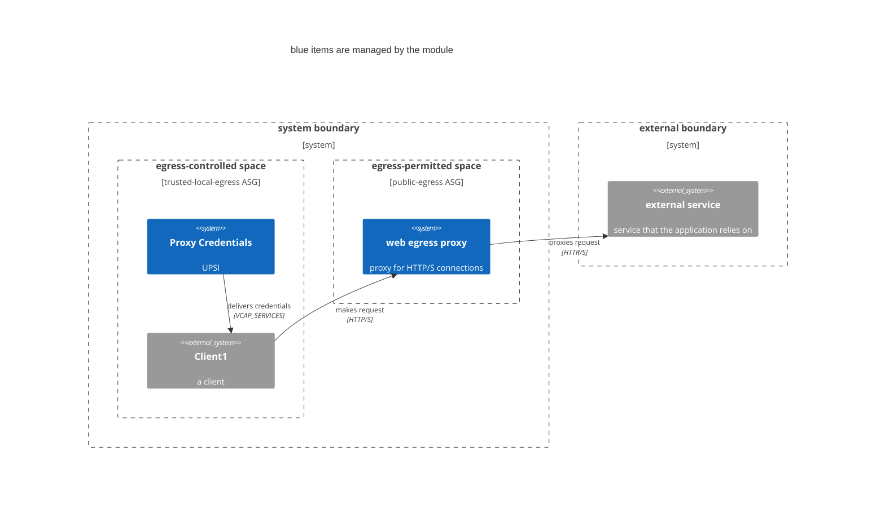

# Egress proxy Terraform module

## Usage

```
module "egress-proxy" {
  source = "<path to module>"

  name          = "egress"
  cf_org_name   = local.cf_org_name
  cf_space_name = local.cf_space_name
  client_space  = local.cf_space_name

  allowlist = {
    client1 = ["*.sam.gov:443", "*.login.gov:443"],
    client2 = ["gsa.gov:443"],
  }
  denylist = {
    client1 = ["bad.sam.gov:443", "verybad.login.gov:443"],
    client2 = ["sobad.gsa.gov:443"]
  }
}
```

Credentials and route for the proxy are stored in the `egress-creds` service in the client space.

> **Note**
> 
> It's up to you to bind the `egress-creds` service to the clients, read the credentials from `VCAP_SERVICES`, and configure your app appropriately to use the proxy!

## Deployment architecture




1. Creates an egress proxy in the designated space
2. Adds network-policies so that clients can reach the proxy
3. Creates a user-provided service instance in the client space with credentials

## TODO

* Once it's possible, [create the UPSI in the egress space and share it to the client space](https://github.com/cloudfoundry-community/terraform-provider-cloudfoundry/issues/481)
* Support multiple client spaces (maybe a map of allowlist and denylist entries per space?)
* Pay attention to the port number; right now it's ignored (the proxy has a fixed set of ports in the config file)
* Pay attention to the client ID; right now allow/deny are a union across all client apps
