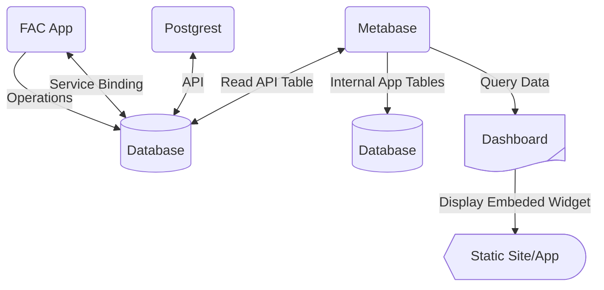

### Description
[Metabase](https://www.metabase.com/) is an open source tool designed as business intelligence platform. By configuring it with a database, it can easily look at the data supplied and build dashboards around the data, either by looking at internal tables or exposed views. Currently, the POC implementation (and future prod implementation) will only expose the `api_` tables to the application, meaning, that all data in that table is already publicly dissemenated, non tribal data.



### Usage
```terraform
module "metabase-app" {
  source        = "../path/to/source"
  cf_org_name   = var.cf_org_name
  cf_space_name = var.cf_space.name
  cf_space_id   = var.cf_space.id
  name          = "metabase"
  app_memory    = "#M"
  disk_quota    = "#M"
  app_instances = #
  buildpacks    = ["https://github.com/cloudfoundry/java-buildpack.git"]
  environment_variables = {
    ENV = upper("{$var.cf_space.name}")
  }
  service_bindings = {
    "${module.database.database_name}"                        = ""
    "${module.metabasedb.database_name}"                      = ""
    "${cloudfoundry_service_instance.proxy_credentials.name}" = ""
  }
  depends_on = [module.metabasedb, module.database]
}

module "metabasedb" {
  source = "github.com/gsa-tts/terraform-cloudgov//database?ref=v2.3.0"

  cf_space_id   = var.cf_space.id
  name          = "metabase-db"
  tags          = ["rds"]
  rds_plan_name = var.database_plan
  json_params   = var.json_params
}
```
