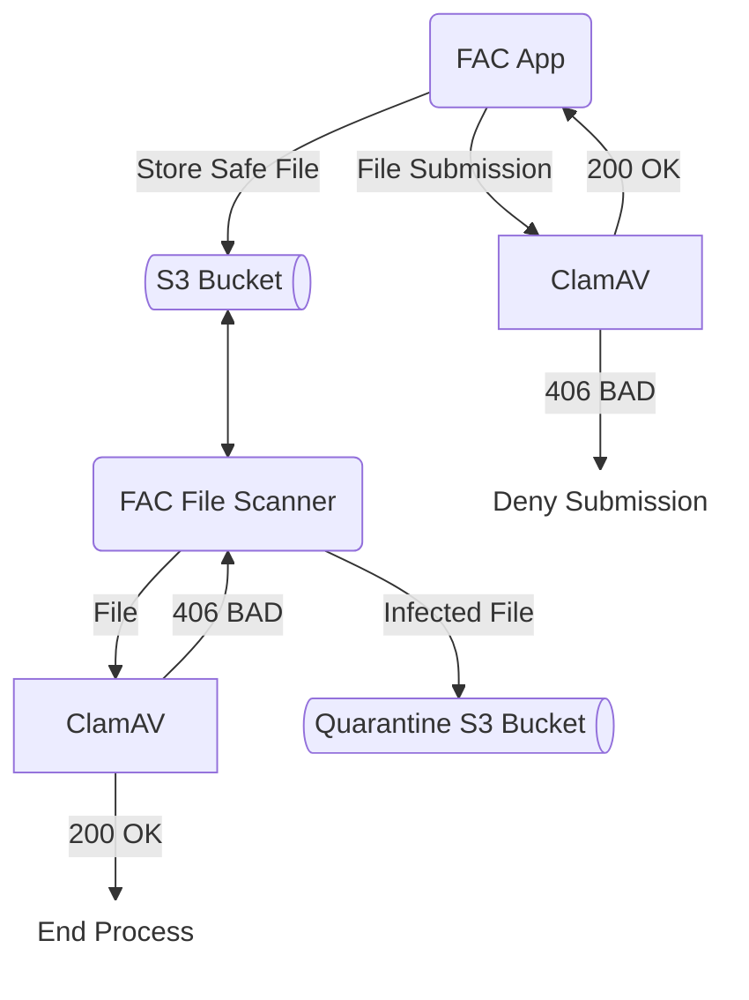

### Description
A small, lightweight app using a `python_buildpack` to deploy a `flask` application in the environment, for the purpose of long running scans.

The file scanner module is composed of a small application that reads from the s3 bucket that the application writes to. The [application](https://github.com/GSA-TTS/fac-periodic-scanner/blob/main/app.py) is responsible to reading items exclusively in the [singleauditreport](https://github.com/GSA-TTS/fac-periodic-scanner/blob/06017a2fb424cc3167789c34a14d9e159d635dab/app.py#L194) bucket and retroactively scanning the files on delay, using a second, dedicated version of the clamav file scanner. The application then sends its results to stdout, where the logshipper forwards the logs to new relic. This "Infected File Found" result is part of the FAC weekly log review.



### Usage
```terraform
module "fac-file-scanner" {
  source            = "../path/to/source"
  name              = local.scanner_name
  cf_org_name       = var.cf_org_name
  cf_space_name     = var.cf_space_name
  https_proxy       = module.https-proxy.https_proxy
  s3_id             = module.s3-private.bucket_id
  logdrain_id       = module.cg-logshipper.logdrain_service_id
  scanner_instances = #
  scanner_memory    = #
  disk_quota        = #
}

resource "cloudfoundry_network_policy" "scanner-network-policy" {
  policy {
    source_app      = module.fac-file-scanner.app_id
    destination_app = module.https-proxy.app_id
    port            = "61443"
    protocol        = "tcp"
  }
}
```
