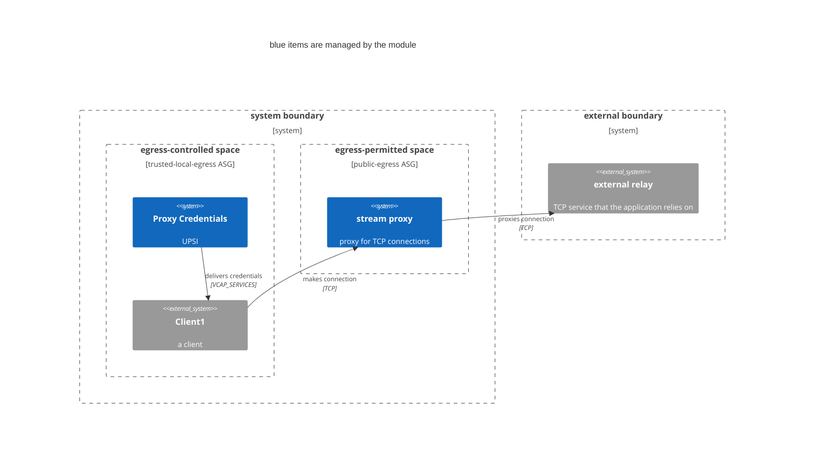

# stream egress proxy Terraform module

## Usage

This example proxies connections to an upstream SMTP relay

```
module "smtp-proxy" {
  source = "<path to module>"

  name          = "smtp-proxy"
  cf_org_name   = local.cf_org_name
  cf_space_name = local.cf_space_name
  client_space  = local.cf_space_name

  upstream = "smtp-relay.gmail.com:587"
  clients = [ "app1" ]
}
```

Credentials and route for the proxy are stored in the `${name}-creds` user-provided service instance in the client space.

> **Note**
> 
> It's up to you to bind the `${name}-creds` service to the clients, read the credentials from `VCAP_SERVICES`, and configure your app appropriately to use the proxy!

## Deployment architecture



1. Creates an egress proxy in the designated space
2. Adds network-policies so that clients can reach the proxy
3. Creates a user-provided service instance in the client space with credentials

## TODO

* Once it's possible, [create the UPSI in the egress space and share it to the client space](https://github.com/cloudfoundry-community/terraform-provider-cloudfoundry/issues/481)
* Require use of a username/password (currently network policies prevent unwanted access)
