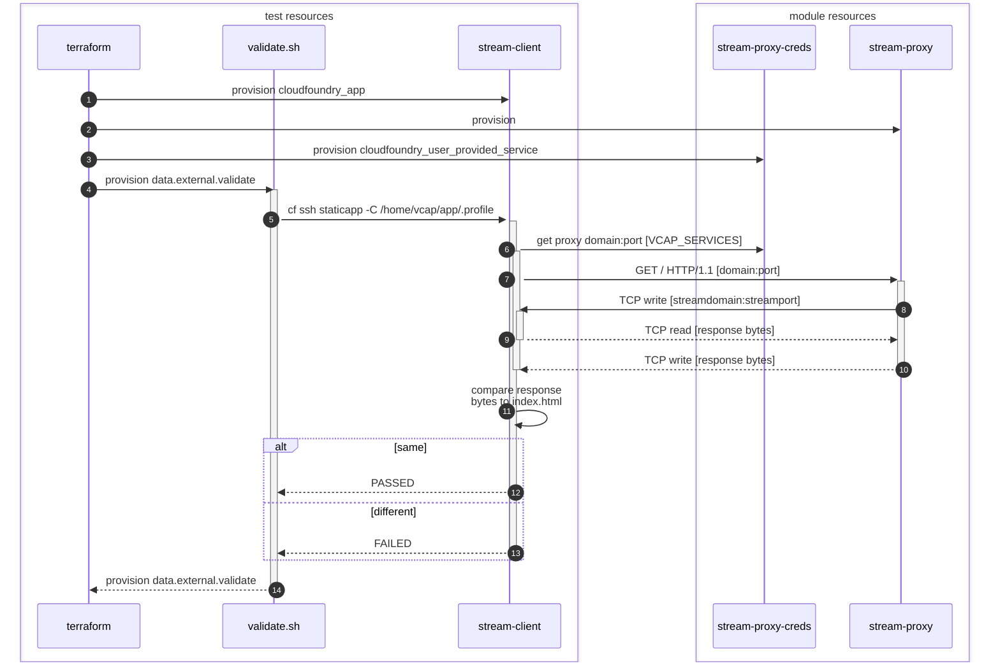

# Test the stream-proxy module
1. Authenticate with cloud.gov (`cf login -a api.fr.cloud.gov --sso`)
2. Copy `terraform.tfvars-template` to `terraform.tfvars` and edit to taste
3. Run `terraform init` to initialize the test Terraform environment
4. Run `terraform apply` to deploy a test fixture app and the proxy
5. Verify "PASSED" in the output
6. Run `terraform destroy` to tear everything down

## Test sequence

In summary:

1. Create a client that will also act as a mock-server
2. Create a stream proxy pointing to the mock-server
3. Have the client make a curl request to the proxy, then check that the bytes returned match the file that it served.